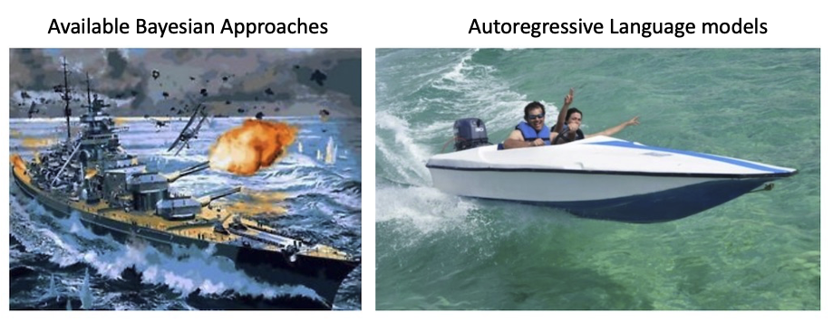

# Higher-Order DeepTrails: Unified Approach to *Trails

 

Abstract
Analyzing, understanding, and describing human behavior is advantageous in different settings, such
as web browsing or traffic navigation. Understanding human behavior naturally helps to improve and
optimize the underlying infrastructure or user interfaces. Typically, human navigation is represented
by sequences of transitions between states. Previous work suggests to use hypotheses, representing
different intuitions about the navigation to analyse these transitions. To mathematically grasp this
setting, first-order Markov chains are used to capture the behavior, consequently allowing to apply
different kinds of graph comparisons, but comes with the inherent drawback of losing information about
higher-order dependencies within the sequences. To this end, we propose to analyse entire sequences
using autoregressive language models, as they are traditionally used to model higher-order dependencies
in sequences. We show that our approach can be easily adapted to model different settings introduced
in previous work, namely HypTrails, MixedTrails and even SubTrails, while at the same time bringing
unique advantages: 1. Modeling higher-order dependencies between state transitions, while 2. being
able to identify short comings in proposed hypotheses, and 3. naturally introducing a unified approach
to model all settings. To show the expressiveness of our approach, we evaluate on different synthetic
datasets and conclude with an exemplary analysis of a real-world dataset, examining the behavior of
users interacting with voice assistants.

Keywords
Behavior Analysis, Sequential Data Analysis, Autoregressive Language Models

Appendix can be found here: https://professor-x.de/deeptrails-arxiv

## How to run
First install the requirements:
`pip install -r requirements.txt`

Then run the code:
Create dataset:
`python train_gpt.py data`
for the synthetic HypTrails dataset,
`python train_gpt.py data-mixedtrails`
for the synthetic MixedTrails dataset and 
`python train_gpt.py data-subtrails`
for the synthetic SubTrails dataset. 

Train model:
`python train_gpt.py even`
for the even model. You can replace `even` with any other hypothesis. For more detail, see `train_gpt.py`. 
For random forest models, use `train_rf.py` instead.
We evaluate our methods using the notebooks in the `Code/Evaluation` folder.
